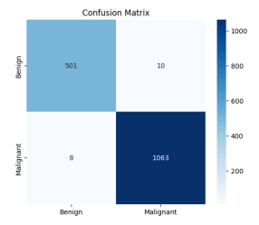

# DeepCancer

**Explainable AI for Breast Histopathology Classification**

DeepCancer is an applied AI research project exploring breast histopathology image classification through a hybrid **Swin Transformer + ConvNeXt** architecture with **Grad-CAM** explainability.

The project combines experimental deep learning research with an interactive research prototype for inspecting classification outputs and model activation patterns.

**Histopathology Image → Hybrid AI Model → Classification → Grad-CAM Interpretation**

> **Research & Education Only**  
> DeepCancer is a research prototype. It is not a clinically validated diagnostic system or an approved medical device and is not intended to replace professional medical judgment.

## Research at a Glance

| | |
| --- | --- |
| **Research Area** | Breast histopathology image classification |
| **Dataset** | BreaKHis |
| **Dataset Size** | 7,909 images · 82 patients |
| **Magnifications** | 40× · 100× · 200× · 400× |
| **Architecture** | Swin Transformer + ConvNeXt |
| **Explainability** | Grad-CAM |
| **Tasks** | Binary + Eight-class classification |
| **Framework** | PyTorch |
| **Publication** | Journal of Artificial Intelligence with Applications, 2025 |

## Hybrid Architecture

DeepCancer combines two complementary visual representation approaches.

<pre>
                     Histopathology Image
                             │
                             ▼
                        Preprocessing
                             │
                  ┌──────────┴──────────┐
                  │                     │
                  ▼                     ▼
              ConvNeXt           Swin Transformer
                  │                     │
                  ▼                     ▼
          Local / Spatial       Global / Contextual
              Features               Features
                  │                     │
                  └──────────┬──────────┘
                             │
                             ▼
                    Hybrid Representation
                             │
                             ▼
                       Classification
                             │
                  ┌──────────┴──────────┐
                  │                     │
                  ▼                     ▼
             Prediction             Grad-CAM
                                          │
                                          ▼
                                  Visual Interpretation
</pre>

**ConvNeXt** provides convolution-based local feature extraction, while **Swin Transformer** contributes window-based contextual representation.

The research investigates their complementary use for histopathological image classification.

**[Explore the architecture →](./docs/architecture.md)**

## Experimental Results

Two separate classification tasks were evaluated on the BreaKHis dataset.

| Task | Accuracy | Precision | Recall | F1-score |
| --- | ---: | ---: | ---: | ---: |
| **Binary** | **98.86%** | **99.07%** | **99.25%** | **99.16%** |
| **Eight-class** | **93.49%** | **93.46%** | **93.49%** | **93.43%** |

### Binary Classification



The binary experiment distinguishes **benign** from **malignant** histopathological images.

The displayed confusion matrix contains **1,644 correct classifications out of 1,662 evaluated samples**.

### Eight-Class Classification

The multiclass experiment extends the task to eight histopathological tumor subtypes:

**Benign:** Adenosis · Fibroadenoma · Phyllodes tumor · Tubular adenoma

**Malignant:** Ductal carcinoma · Lobular carcinoma · Mucinous carcinoma · Papillary carcinoma

**[View the complete experimental results →](./docs/results.md)**  
**[Read the experimental methodology →](./docs/methodology.md)**

> These metrics represent experimental benchmark results obtained on the BreaKHis research dataset. They must not be interpreted as clinical validation or real-world diagnostic performance.

## Explainable AI

DeepCancer incorporates **Grad-CAM** to provide visual information about image regions associated with model predictions.


The research prototype exposes:

- Original histopathological image
- Combined Grad-CAM visualization
- Global/context-oriented visualization
- Local-feature-oriented visualization

These visualizations are intended for research-oriented inspection of model behavior.

They are not pathological annotations and do not establish that a prediction is medically correct.

**[Explore explainability →](./docs/explainability.md)**

## Research Prototype

The research model is exposed through an interactive image-analysis workflow.


<pre>
Research-Use Conditions
        │
        ▼
Histopathology Image
        │
        ▼
AI Analysis
        │
        ▼
Classification Output
        │
        ▼
Grad-CAM Interpretation
</pre>

### Example Model Output


The screenshot above represents an **individual example inference**.

The probability displayed by the interface belongs to that specific analyzed sample and must not be interpreted as overall model accuracy or as the probability that a patient has cancer.

**[Explore the prototype interface →](./docs/interface.md)**

## Dataset

DeepCancer was experimentally evaluated using the open-access **BreaKHis (Breast Cancer Histopathological Image Classification)** dataset.

| Property | Value |
| --- | --- |
| Images | **7,909** |
| Patients | **82** |
| Magnifications | **40×, 100×, 200×, 400×** |
| Staining | H&E |
| Original resolution | 700 × 460 |
| Model input | 224 × 224 |
| Classification tasks | Binary + Eight-class |

The dataset itself is not distributed through this repository.

## Experimental Environment

The published experiments were conducted using:

- **PyTorch**
- **Google Colab**
- **NVIDIA A100 GPU**
- **Adam optimizer**
- **Cross-Entropy Loss**
- **20 training epochs**
- Early stopping based on validation loss

The multiclass configuration additionally used StepLR learning-rate scheduling.

The accompanying prototype was designed to support inference independently from the original GPU training environment.

## Published Research

The methodology and experimental results were published as:

### Histopathological Breast Cancer Classification Using a Hybrid Swin Transformer and ConvNeXt Architecture

**Murat Onur Kaderoğlu · Emre Şatır**

*Journal of Artificial Intelligence with Applications*  
2025 · 6(1) · 18–25

**DOI:** [10.5281/zenodo.18138734](https://doi.org/10.5281/zenodo.18138734)

[](https://doi.org/10.5281/zenodo.18138734)

### Citation

```text
Kaderoğlu, M. O., & Şatır, E. (2025).
Histopathological Breast Cancer Classification Using a Hybrid Swin Transformer
and ConvNeXt Architecture.
Journal of Artificial Intelligence with Applications, 6(1), 18–25.
https://doi.org/10.5281/zenodo.18138734
```

## Research Limitations

The experimental results should be interpreted within the boundaries of the published study.

The current work was trained and evaluated using a single public research dataset. It has not established generalization across independent hospitals, pathology laboratories, scanner systems, staining protocols, tissue preparation procedures, or prospective patient populations.

Future research directions identified in the study include:

- Multi-institutional validation
- Evaluation across diverse scanner and staining conditions
- Domain adaptation
- Stain normalization
- Prospective evaluation with pathologists
- Further interpretability research
- Multimodal data integration

## Clinical Boundary

DeepCancer is currently a **research and educational prototype**.

It is not presented as:

- A clinically validated diagnostic system
- An autonomous diagnostic tool
- A replacement for a pathologist
- An FDA- or CE-approved medical device
- A system for making treatment decisions

Any future transition toward clinical use would require independent validation, prospective clinical evaluation, appropriate regulatory processes, and assessment in representative clinical environments.

## Documentation

| Document | Description |
| --- | --- |
| **[Architecture](./docs/architecture.md)** | Hybrid Swin Transformer + ConvNeXt architecture |
| **[Methodology](./docs/methodology.md)** | Dataset, preprocessing, training and evaluation |
| **[Experimental Results](./docs/results.md)** | Metrics, confusion matrices, training curves and ROC analysis |
| **[Explainability](./docs/explainability.md)** | Grad-CAM and model interpretability |
| **[Prototype Interface](./docs/interface.md)** | End-to-end research prototype workflow |

## Public Documentation Boundary

This repository is a public technical and research showcase.

It documents the research methodology, architecture, experimental results, explainability approach, and prototype workflow.

The repository does not distribute production model weights, private implementation code, infrastructure credentials, deployment secrets, restricted datasets, or security-sensitive configuration.

## Project Resources

**Research Platform:** [DeepCancer.org](http://deepcancer.org/)

**System Overview:**  
[DeepCancer — Explainable AI for Breast Histopathology](https://tankdev.tech/tr/systems/deepcancer)

**Engineering Case Study:**  
[DeepCancer Case Study](https://tankdev.tech/tr/case-studies/deepcancer)

**Published Research:**  
[DOI: 10.5281/zenodo.18138734](https://doi.org/10.5281/zenodo.18138734)

## About

DeepCancer is an applied AI research project developed within the **[TankDev](https://tankdev.tech)** engineering portfolio.

TankDev works across custom software, applied artificial intelligence, process automation, web applications, and system integration.

---

**Research & Education Only — Not for Clinical Diagnosis**

[DeepCancer](http://deepcancer.org/) · [TankDev](https://tankdev.tech) · [Research](https://doi.org/10.5281/zenodo.18138734) · [Case Study](https://tankdev.tech/tr/case-studies/deepcancer)
