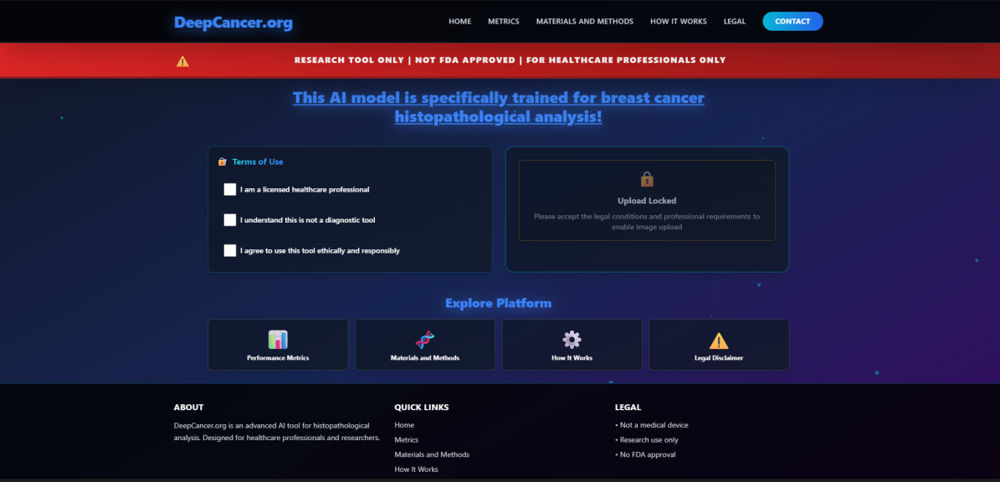
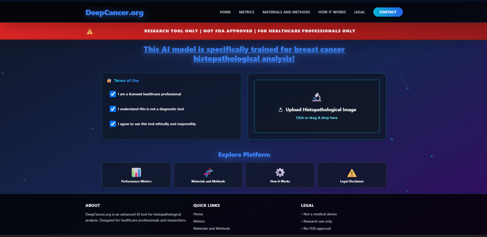
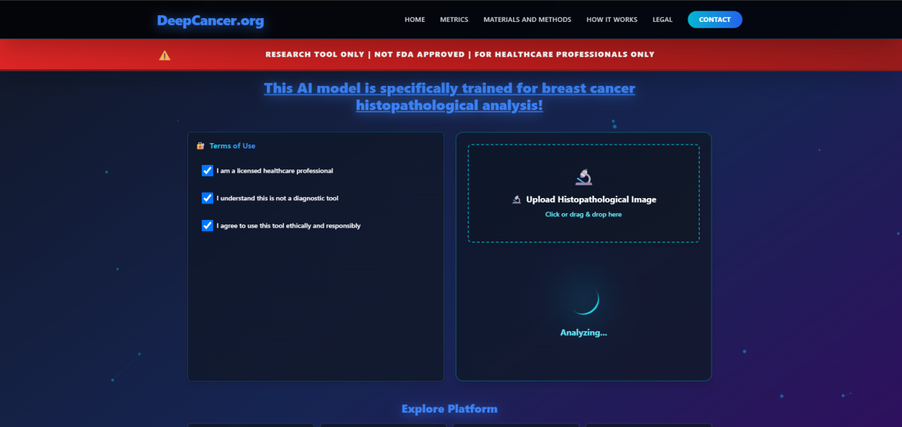
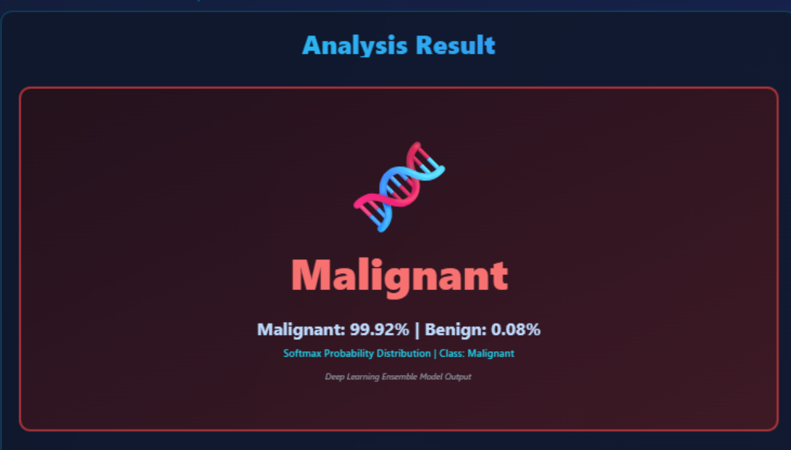
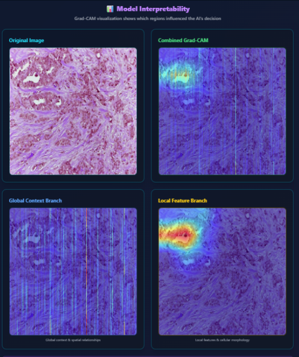

# Research Prototype Interface

## Overview

DeepCancer includes an interactive web-based research prototype for exploring the histopathological image classification workflow.

The interface connects the research model to a controlled user workflow:

<pre>
Research-use Conditions
        │
        ▼
Image Upload
        │
        ▼
AI Analysis
        │
        ▼
Classification Output
        │
        ▼
Grad-CAM Interpretation
</pre>

The interface is designed to demonstrate and inspect the research workflow.

It is not a clinical diagnostic interface or a medical device.

## Research-Use Gate

Before image upload is enabled, the prototype presents explicit research-use conditions.

The upload area remains unavailable until the required conditions are acknowledged.

The interface communicates that the system is:

- A research tool
- Not an approved medical device
- Not intended to replace professional medical judgment

This boundary is part of the interface rather than being limited to external documentation.

## Image Upload

After the required conditions are acknowledged, the histopathological image upload area becomes available.

The prototype accepts an image as the input to the research inference workflow.

<pre>
Histopathology Image
        │
        ▼
      Upload
        │
        ▼
 Input Processing
        │
        ▼
 Hybrid Model
</pre>

The interface abstracts the underlying model pipeline so the research workflow can be explored without interacting directly with model code.

## Analysis State

During inference, the interface exposes an analysis state.

Conceptually, the workflow proceeds through:

<pre>
Uploaded Image
      │
      ▼
Preprocessing
      │
      ▼
ConvNeXt + Swin Transformer
      │
      ▼
Hybrid Representation
      │
      ▼
Classification Output
</pre>

The interface represents the user-facing layer of this process; it does not expose the complete internal inference implementation.

## Classification Output

After analysis, the prototype presents the resulting predicted class and model probability distribution.

The displayed screenshot is an **individual example inference** in which the model produced a malignant-class prediction.

The percentages shown on this screen are the model output for that specific sample.

They are not:

- Overall model accuracy
- Dataset-level sensitivity
- Dataset-level specificity
- Clinical confidence
- A probability that a patient has cancer

Dataset-level experimental performance is documented separately in [Experimental Results](./results.md).

## Explainability Output

The research workflow also exposes Grad-CAM-based interpretability information.

The interface provides views of:

- The original histopathological image
- Combined Grad-CAM visualization
- Global/context-oriented representation
- Local-feature-oriented representation

These visualizations are intended to make model behavior more inspectable during research.

They do not constitute pathological annotations or clinical validation.

For a more detailed discussion, see [Explainability](./explainability.md).

## End-to-End Prototype Workflow

The implemented interface can therefore be summarized as:

<pre>
┌─────────────────────────────┐
│     Research-Use Gate       │
└──────────────┬──────────────┘
               │
               ▼
┌─────────────────────────────┐
│ Histopathology Image Upload │
└──────────────┬──────────────┘
               │
               ▼
┌─────────────────────────────┐
│       Preprocessing         │
└──────────────┬──────────────┘
               │
               ▼
┌─────────────────────────────┐
│ Swin Transformer + ConvNeXt │
└──────────────┬──────────────┘
               │
               ▼
┌─────────────────────────────┐
│    Classification Output    │
└──────────────┬──────────────┘
               │
               ▼
┌─────────────────────────────┐
│ Grad-CAM Interpretability   │
└─────────────────────────────┘
</pre>

This connects the underlying experimental model to an accessible research interface while maintaining an explicit separation between model output and clinical decision-making.

## Interface and Research Architecture

The web interface should be considered separately from the underlying research model.

<pre>
User Interface
      │
      ▼
Inference Workflow
      │
      ▼
Research Model
      │
      ├── ConvNeXt
      └── Swin Transformer
      │
      ▼
Model Output
      │
      ├── Classification
      └── Interpretability
</pre>

The interface can evolve independently while the research methodology and experimental results remain documented separately.

## Prototype Scope

The public prototype demonstrates:

- Research-use acknowledgement
- Histopathological image upload
- Model inference workflow
- Binary classification output
- Probability distribution output
- Grad-CAM-based model inspection

The interface should not be interpreted as evidence that the system has completed clinical validation.

## Security and Public Documentation

This repository documents the public-facing behavior and research architecture of DeepCancer.

It does not expose:

- Infrastructure credentials
- Deployment secrets
- Private environment configuration
- Security-sensitive implementation details
- Production model weights
- Restricted datasets

The public documentation is intended to demonstrate the engineering and research methodology without exposing operationally sensitive components.

## Live Research Prototype

The current public research interface is available at:

**[DeepCancer.org](http://deepcancer.org/)**

Availability and implementation details of the live prototype may evolve independently of the published experimental study.

## Related Documentation

- [Architecture](./architecture.md)
- [Experimental Methodology](./methodology.md)
- [Experimental Results](./results.md)
- [Explainability](./explainability.md)
- [Project Overview](../README.md)

## Published Research

**Histopathological Breast Cancer Classification Using a Hybrid Swin Transformer and ConvNeXt Architecture**

Murat Onur Kaderoğlu · Emre Şatır

[DOI: 10.5281/zenodo.18138734](https://doi.org/10.5281/zenodo.18138734)

---

**Research & Education Only — Not for Clinical Diagnosis**
