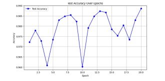
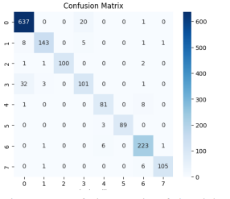
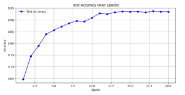
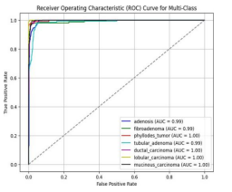

# Experimental Results

## Overview

DeepCancer was experimentally evaluated on the **BreaKHis breast histopathology dataset** for two separate classification tasks:

1. Binary classification — benign vs. malignant
2. Eight-class classification — breast tumor subtype classification

The results documented on this page correspond to the controlled experimental setting described in the published research.

> **Important:** These are experimental benchmark results obtained on a research dataset. They do not represent clinical validation or real-world diagnostic performance.

## Results Summary

| Task | Accuracy | Precision | Recall | F1-score |
| --- | ---: | ---: | ---: | ---: |
| Binary classification | **98.86%** | **99.07%** | **99.25%** | **99.16%** |
| Eight-class classification | **93.49%** | **93.46%** | **93.49%** | **93.43%** |

## Binary Classification

The binary experiment distinguishes histopathological images between:

- Benign
- Malignant

The published study reports an overall test accuracy of **98.86%**.

### Performance

| Metric | Result |
| --- | ---: |
| Accuracy | **98.86%** |
| Precision | **99.07%** |
| Recall | **99.25%** |
| F1-score | **99.16%** |

### Confusion Matrix

The binary confusion matrix contains:

| Ground Truth | Predicted Benign | Predicted Malignant |
| --- | ---: | ---: |
| Benign | **581** | **10** |
| Malignant | **8** | **1063** |

This corresponds to **1,644 correct classifications out of 1,662 evaluated samples** in the displayed confusion matrix.

The matrix provides a direct view of the distribution of correct and incorrect predictions in this experimental evaluation.

### Training / Test Accuracy Behavior

The published experiment tracked test accuracy across training epochs.

The curve shows variation during training while the final reported binary test accuracy reached **98.86%**.

The graph should be interpreted as part of the experimental training record rather than evidence of performance outside the evaluated dataset.

## Eight-Class Classification

The multiclass experiment distinguishes eight histopathological tumor subtypes.

### Benign Classes

- Adenosis
- Fibroadenoma
- Phyllodes tumor
- Tubular adenoma

### Malignant Classes

- Ductal carcinoma
- Lobular carcinoma
- Mucinous carcinoma
- Papillary carcinoma

### Performance

| Metric | Result |
| --- | ---: |
| Accuracy | **93.49%** |
| Precision | **93.46%** |
| Recall | **93.49%** |
| F1-score | **93.43%** |

The results indicate lower overall classification performance than the binary task, reflecting the more granular eight-class classification problem.

### Confusion Matrix

The confusion matrix provides a class-level view of predictions across the eight tumor subtypes.

The published analysis reports generally strong classification behavior while also identifying partial misclassification among some histopathologically similar classes.

This is particularly relevant in multiclass histopathology, where visually related tissue patterns can introduce ambiguity between categories.

### Training / Test Accuracy Behavior

The multiclass experiment shows progressive improvement in test accuracy during training.

The published study reports an overall eight-class test accuracy of **93.49%**.

The training curve is presented as an experimental record and should not be interpreted independently of the dataset and evaluation methodology.

## ROC Analysis

Class-wise discriminative behavior was additionally evaluated using **Receiver Operating Characteristic (ROC)** analysis.

The published study reports that several tumor subtypes achieved **AUC values above 0.95**, indicating strong discriminative behavior for those classes within the experimental dataset.

At the same time, uncertainty remained between some histopathologically similar categories.

ROC and AUC results therefore describe model behavior within the benchmark experiment and do not establish clinical diagnostic performance.

## Binary vs. Multiclass Evaluation

The two experiments represent substantially different classification problems.

<pre>
Binary Classification
        │
        ├── Benign
        └── Malignant

Eight-Class Classification
        │
        ├── Benign
        │     ├── Adenosis
        │     ├── Fibroadenoma
        │     ├── Phyllodes tumor
        │     └── Tubular adenoma
        │
        └── Malignant
              ├── Ductal carcinoma
              ├── Lobular carcinoma
              ├── Mucinous carcinoma
              └── Papillary carcinoma
</pre>

Binary classification addresses a broader distinction between benign and malignant tissue.

The eight-class experiment requires the model to discriminate between more specific tumor subtypes, including categories with potentially similar histopathological characteristics.

The reported metrics should therefore be interpreted in the context of their respective tasks rather than treated as directly interchangeable measurements.

## Interpretation Boundary

The experimental results demonstrate the behavior of the proposed hybrid architecture under the conditions of the published study.

They do **not** establish:

- Clinical sensitivity or specificity in a prospective patient population
- Performance across independent hospitals
- Generalization across pathology laboratories
- Robustness across different scanners
- Robustness across staining protocols
- Performance across different tissue preparation procedures
- Regulatory-grade clinical performance

The research itself identifies broader validation as necessary before considering clinical deployment.

## Limitations

The principal experimental limitation is that training and evaluation were performed using a single public dataset.

Real-world histopathology data may differ because of factors including:

- Scanner characteristics
- Staining procedures
- Tissue preparation
- Institutional workflows
- Data distribution
- Patient populations
- Label quality

Consequently, high benchmark performance should not be interpreted as evidence that equivalent performance would be reproduced in an independent clinical environment.

## Next Validation Steps

The published research identifies several directions for extending the work:

- Multi-institutional validation
- Evaluation across diverse scanner models
- Evaluation across different staining protocols
- Domain adaptation
- Stain normalization
- Test-time augmentation
- Prospective evaluation with pathologists
- Further interpretability research
- Multimodal data integration

These steps represent future research directions rather than completed validation.

## Related Documentation

- [Architecture](./architecture.md)
- [Experimental Methodology](./methodology.md)
- [Explainability](./explainability.md)
- [Prototype Interface](./interface.md)
- [Project Overview](../README.md)

## Published Research

**Histopathological Breast Cancer Classification Using a Hybrid Swin Transformer and ConvNeXt Architecture**

Murat Onur Kaderoğlu · Emre Şatır

[DOI: 10.5281/zenodo.18138734](https://doi.org/10.5281/zenodo.18138734)

---

**Research & Education Only — Not for Clinical Diagnosis**
